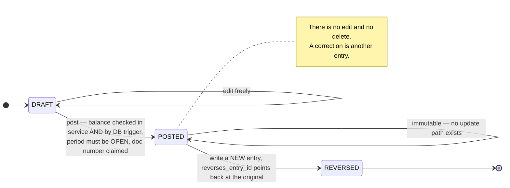
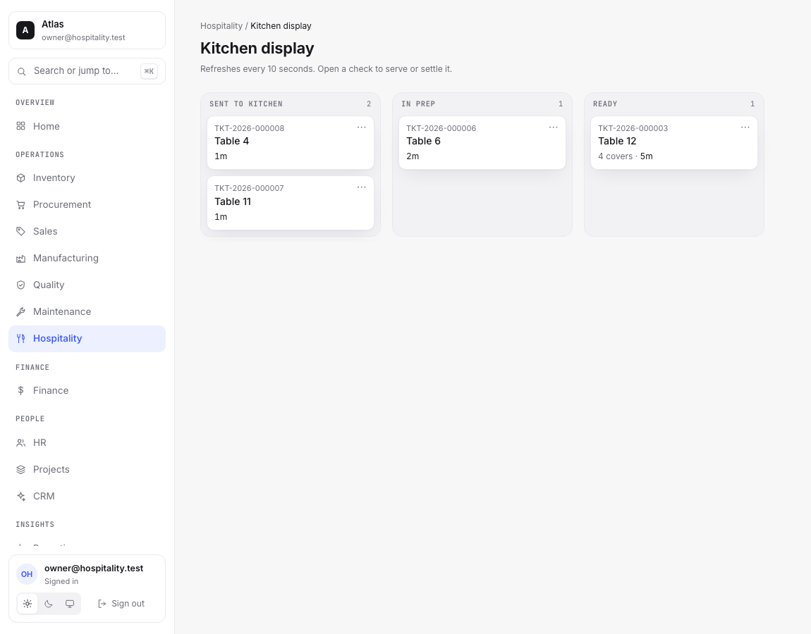

**Atlas is an open-source, industry-agnostic ERP platform. Its functional benchmark is SAP S/4HANA.**

Atlas is a book you can post to but never erase.

Every number in the system is either a posted line or a projection of posted lines. No total is ever stored, so there is nothing to reconcile and nothing to drift. A posted journal entry is immutable: you correct it by writing a reversing entry that points back at the original through `reverses_entry_id`. Stock moves are append-only and POSTED at creation with no draft phase, because a move *is* the ledger, and on-hand is a projection you can rebuild from it. Every business document registers itself and records its predecessor, so any figure walks back to the transaction that caused it.

That rule is enforced three times over: in the service layer, in the ORM type system, and in PostgreSQL triggers. A book whose invariant depends on the care of whoever is writing in it is not a book of record.

The principle is accounting's, and it is four hundred years old. Atlas is what it looks like taken literally in code.

Scope comes from a researched [parity map](docs/research/s4hana-parity.md) of S/4HANA's line-of-business modules, which marks every capability full, partial, or out-of-scope for v1 with a reason and an upgrade path. The build journal is public as well: [PLAN.md](PLAN.md), [PROGRESS.md](PROGRESS.md), [DECISIONS.md](DECISIONS.md).

---

## Quickstart

Prerequisite: Docker with the Compose plugin. Everything else runs in containers.

1. `git clone https://github.com/Taha-Mahmoodi/atlas-erp.git && cd atlas-erp`
2. `docker compose up --build` — starts PostgreSQL, the API (migrations run on boot), the web app, the hospitality tenant's guest website, and a one-shot seed job that populates **seven demo tenants** (`acme` plus one per industry template) with about three months of interlinked transactions through the real API. The first seed takes a few minutes. It is done when `seed-1` prints its per-tenant summaries and exits 0.
3. Open **http://localhost:5173** and log in: tenant `acme`, email `owner@acme.test`, password `correct-horse-battery`. The other tenants (`manufacturing`, `retail`, `professional-services`, `healthcare`, `construction`, `hospitality`) use `owner@<tenant>.test` with the same password.
4. Open **http://localhost:8080** for the other kind of surface: the `hospitality` tenant's restaurant website. Tonight's menu with the kitchen's 86 board applied, an order that reaches the kitchen display in the console, a table booking that lands in the reservation book. It talks to the same API as a machine client, holding a scoped API key that its nginx keeps and the browser never sees, which makes it the working reference for [the website contract](docs/api.md#the-property-website-contract).
5. The API is browsable: OpenAPI UI at http://localhost:8000/api/v1/docs, health at http://localhost:8000/api/v1/health.
6. Tear down with `docker compose down -v`.

Use `down -v` rather than `down` before re-seeding. Running `up` against an already-seeded volume currently crashes the seed on the hospitality tenant, because role assignment is not idempotent and trips `uq_core_user_roles_tenant_id_user_id_role_id`.

Seeding is opt-in via `ATLAS_SEED_DEMO` (`1` in compose, set `0` to skip) and refuses to run against a production database. Set a real `ATLAS_JWT_SECRET` for anything reachable from outside your machine. For non-Docker contributor workflows see [CONTRIBUTING.md](CONTRIBUTING.md).

---

## Trace it back


One sale crossing two modules. Every document registers itself in `core_documents` and records its predecessor in `core_doc_links`, and each claims its own gapless number as `{prefix}-{year}-{padded}` ([`core/numbering.py`](backend/app/core/numbering.py)).

Two details in that picture are worth pausing on.

The dashed boundary marks the only edge in the chain that crosses a module, and it is the only one carried by an event rather than a foreign key. Sales publishes `BillingInvoiced`; finance subscribes in [`handlers/order_to_cash.py`](backend/app/modules/finance/handlers/order_to_cash.py). Sales does not know finance exists. That is the module boundary rule doing its job in the one place you can see it.

The dotted `billed_by` arc exists because `core_doc_links` is a graph rather than a linked list. `docflow.get_document_chain` returns every connected node and every edge, so a billing document reached from an order and a billing document reached from a delivery are the same node.

The whole chain is asserted end to end in [`tests/modules/sales/test_billing.py`](backend/tests/modules/sales/test_billing.py) as `test_post_links_docflow_order_delivery_billing_invoice`.

**One caveat, stated plainly:** the chain is real at the API and data layer, and `GET /api/v1/documents/{id}/chain` returns it. There is no screen that draws it. `DocFlowViewer.tsx` is written and tested but no route mounts it, so it is tree-shaken out of the shipped bundle. If you want to see a chain today, call the endpoint.

---

## Architecture


### Where effects travel

Modules never import each other's `service.py` or `models.py`. Cross-module effects go through the event bus, and the subscription graph has two sinks:

```
finance      <- hr · industry · inventory · manufacturing · procurement · sales     [6 publishers]
inventory    <- hospitality · industry · manufacturing · procurement · quality · sales  [6 publishers]
procurement  <- industry · manufacturing                                            [2]
quality      <- procurement                                                         [1]
sales        <- crm                                                                 [1]
```

Finance subscribes to six modules and publishes to none of them. It also exposes no `queries.py` at all, so nothing reads out of it synchronously either. Effects flow into finance and stop, which is what "the journal is the bottom of the stack" means when you grep for it.

Reads that must be synchronous go through the owning module's `queries.py`. Inventory is the most-read module in the codebase, imported by seven others.

Reproduce both graphs:

```bash
grep -rl "app.modules.<owner>.events" backend/app/modules --include='*.py'
grep -rl "app.modules.<owner>.queries" backend/app/modules --include='*.py'
```

### The rule to learn before your first query

Every request runs inside one tenant context. A session-level ORM filter injects `tenant_id` into every query, including lazy loads and bulk writes, and **fails closed when no tenant is set**. There is no way for a query author to bypass it, and no code path where forgetting the filter silently returns another tenant's rows.

Full specification in [docs/architecture.md](docs/architecture.md); every consequential choice is logged in [DECISIONS.md](DECISIONS.md).

---

## The chart of accounts

Fourteen modules and the core platform, numbered in dependency order rather than alphabetically, so the number itself tells you which way imports may point ([STRUCTURE.md §5](STRUCTURE.md)). Table counts are `__tablename__` declarations in each package and sum to 132.

| | Module | Tables | What it owns |
|---|---|---:|---|
| **0000** | [core](docs/modules/core.md) | 16 | Tenancy, auth, RBAC, audit, the document registry, numbering, the event bus. Imports nothing from modules. |
| **1000** | [finance](docs/modules/finance.md) | 29 | The universal journal. Subscribes to six modules, exposes no query interface, publishes nothing outward. |
| **1100** | [inventory](docs/modules/inventory.md) | 15 | The move ledger. On-hand is a projection of it. The most-imported `queries.py` in the codebase. |
| **2000** | [procurement](docs/modules/procurement.md) | 14 | Requisition, RFQ, PO, goods receipt, 3-way match, AP bill. |
| **2100** | [sales](docs/modules/sales.md) | 14 | Quote, order, delivery, billing, returns. |
| **3000** | [manufacturing](docs/modules/manufacturing.md) | 11 | BOMs, routings, work centers, production orders with WIP journals, MRP. |
| **3100** | [quality](docs/modules/quality.md) | 1 | Goods-receipt inspection lots and disposition. |
| **3200** | [maintenance](docs/modules/maintenance.md) | 3 | Equipment register, corrective and preventive orders. |
| **4000** | [hr](docs/modules/hr.md) | 11 | Employees with masked compensation, leave accruals, time, gross-to-net payroll. |
| **4100** | [projects](docs/modules/projects.md) | 2 | Projects and WBS as costing objects. |
| **5000** | [crm](docs/modules/crm.md) | 4 | Leads, opportunities, activities, conversion into sales. |
| **6000** | [reporting](docs/modules/reporting.md) | 0 | Dashboard KPIs and a whitelist-driven report builder. Owns no tables by design: it reads projections. |
| **7000** | [admin](docs/modules/admin.md) | 2 | Users, roles, permission catalog, audit viewer, number sequences. |
| **8000** | [industry](docs/modules/industry.md) | 1 | Six industry templates applied idempotently, plus tenant onboarding. |
| **9000** | [hospitality](docs/modules/hospitality.md) | 9 | The only vertical that is built, and only its restaurant half. |

Reporting owning zero tables is the clearest statement of the whole design: the reporting module has nothing to store, because every figure it shows is a projection of the journal.

### Every module has the same seven files

Learn one module and you have learned fourteen. [STRUCTURE.md §3](STRUCTURE.md) fixes this shape and forbids inventing a new file type per module.

```
modules/<name>/
├── models.py       SQLAlchemy models          (split into models/ only past 600 lines)
├── schemas.py      Pydantic request/response  (same split rule)
├── service.py      ALL business logic         (split into service/, one file per aggregate)
├── router.py       thin HTTP only: parse → call service → return schema
├── events.py       events this module PUBLISHES — dataclasses, no logic
├── handlers.py     subscriptions to OTHER modules' events
└── constants.py    enums, status values, doc types, number prefixes
```

If finance needs depreciation logic it becomes `service/depreciation.py`. It does not become a new top-level file. Tests mirror the same paths under `backend/tests/`.

---

## The mistake you are going to make

Atlas stores money and quantities through three `TypeDecorator`s in [`core/money.py`](backend/app/core/money.py). On PostgreSQL they are `NUMERIC`. On SQLite they are scaled integers of minor units, because plain `sa.Numeric` round-trips through float on SQLite and quietly loses precision, which would make the database-level balance trigger meaningless.

That abstraction is what lets the same suite run on both engines. It also sets one trap, and the trap is already commented in the source at [`hospitality/service/availability.py`](backend/app/modules/hospitality/service/availability.py):

```python
values: dict[str, object] = {
    # ``literal`` with the COLUMN'S type: a bare Decimal in a CASE arm has no column context,
    # so it binds through the default Numeric — skipping QuantityType's micro-unit scaling on
    # SQLite and landing as value/10^6. Invisible on Postgres, where NUMERIC(18,6) binds plain.
    "remaining_qty": case(
        *[
            (
                MenuAvailability.id == row.id,
                literal(remaining, MenuAvailability.remaining_qty.type),
            )
            for row, remaining in burns
        ]
    )
}
```

A bare `Decimal` in a `CASE` arm passes on the engine you deploy on and fails on the engine you test on. Bind with the column's type whenever you build a `CASE` over a money or quantity column.

---

## The journal, as a state machine



## Data model

The load-bearing tables out of 132. Every table also carries `tenant_id`, omitted below. Every postable row is registered in `core_documents`, whose `core_doc_links` edges form the graph the document flow walks. AP/AR journal lines reference vendors and customers by an opaque `partner_id`, so finance imports no other module's models.

```mermaid
erDiagram
    adm_tenants ||--o{ core_users : has
    adm_tenants {
        uuid id PK
        string slug
    }
    core_users {
        uuid id PK
        string email
        int token_version
    }

    core_documents ||--o{ core_doc_links : "predecessor of"
    core_documents ||--o{ core_doc_links : "successor of"
    core_documents {
        uuid id PK
        string doc_type "31 registered types"
        string doc_no "gapless, claimed at posting"
    }
    core_doc_links {
        uuid predecessor_id FK
        uuid successor_id FK
        string link_type
    }

    fin_journal_entries ||--o{ fin_journal_lines : contains
    fin_accounts ||--o{ fin_journal_lines : posts_to
    fin_fiscal_periods ||--o{ fin_journal_entries : "open period only"
    core_documents ||--|| fin_journal_entries : registers
    fin_journal_entries {
        uuid id PK
        string entry_number
        date posting_date
        string status "DRAFT to POSTED, immutable after"
        uuid reverses_entry_id FK "corrections only via reversal"
    }
    fin_journal_lines {
        uuid journal_entry_id FK
        uuid account_id FK
        decimal debit_xor_credit "one side CHECK"
        uuid cost_center_id "CO dimensions on the line"
        uuid partner_id "opaque vendor or customer ref"
    }
    fin_accounts {
        uuid id PK
        string code
        string type "asset liability equity revenue expense"
    }
    fin_fiscal_periods {
        uuid id PK
        string status "OPEN or CLOSED, DB trigger enforced"
    }

    inv_items ||--o{ inv_stock_moves : moves
    inv_warehouses ||--o{ inv_stock_moves : "in or out"
    core_documents ||--|| inv_stock_moves : registers
    inv_items {
        uuid id PK
        string code
        string costing_method "moving average or FIFO"
    }
    inv_warehouses {
        uuid id PK
        string code
    }
    inv_stock_moves {
        uuid item_id FK
        uuid warehouse_id FK
        decimal quantity
        string move_type "receipt issue transfer count"
    }

    proc_vendors ||--o{ proc_purchase_orders : receives
    core_documents ||--|| proc_purchase_orders : registers
    proc_purchase_orders {
        uuid vendor_id FK
        string po_number
        string status
    }

    sales_customers ||--o{ sales_orders : places
    core_documents ||--|| sales_orders : registers
    sales_customers {
        uuid id PK
        string name
        decimal credit_limit
    }
    sales_orders {
        uuid customer_id FK
        string order_number
        string status
        decimal total_amount
    }
```



Around these sit each module's lines, receipts, cost layers, quants, BOMs, routings, employees, WBS elements and opportunities, all on the same pattern: module-prefixed tables, composite tenant foreign keys, and document registration for anything postable.

---

## The vertical that exists

Hospitality is the only industry module built, and only its restaurant half. It stores menu availability as 86 / countdown / time-box, fires order tickets to the kitchen, depletes ingredients off the sale, and serves a property's own website over a machine API key.



Phase 20, the hotel half, is a [plan file](docs/research/phase-20-rooms-folio-plan.md) rather than code. Rooms and folio do not exist. Guest payment capture and split checks do not exist either, though vendor payments, customer receipts, and payment runs do exist in finance.

---

## The trial balance

The one report that says whether a book is sound. Both columns are real.

| Proven | | Outstanding | |
|---|---:|---|---:|
| Tests collected | 2,334 | Open issues carried forward | 3 |
| Lines of test code | 58,270 | Files over the STRUCTURE §8.4 size cap ([#176](https://github.com/Taha-Mahmoodi/atlas-erp/issues/176)) | 9 |
| Lines of source code | 74,325 | Verticals built, of two planned | 1 |
| Migrations round-tripped on PostgreSQL 16 | 53 | Screens drawing a document chain | 0 |
| Merged pull requests | 167 | | |
| Numbered decisions on record | 82 | | |

Every pull request runs pytest on SQLite, then `alembic upgrade head → downgrade base → upgrade head` on PostgreSQL 16, then the Postgres-marked guard subset. Both engines, every time. There is 0.78 lines of test for every line of source.

The three issues the v1.3.0 release notes carry forward: [#216](https://github.com/Taha-Mahmoodi/atlas-erp/issues/216), an upgrade that leaves a numbering gap in place for a tenant corrupted before the upgrade; [#213](https://github.com/Taha-Mahmoodi/atlas-erp/issues/213), forms and dialogs needing an audit for a missing close affordance; and [#176](https://github.com/Taha-Mahmoodi/atlas-erp/issues/176).

---

## Stack

| Layer | Choice |
|---|---|
| Backend | Python 3.12 · FastAPI · SQLAlchemy 2.0 (async) · PostgreSQL 16, SQLite-compatible tests · Alembic · Pydantic v2 |
| Frontend | React 18 · TypeScript · Vite · TanStack Query + Router · Tailwind · in-house component library |
| Platform | Row-level multi-tenancy · JWT + RBAC-as-data · append-only audit · in-process domain-event bus · REST `/api/v1`, 130 routes |

---

## What v1 deliberately excludes, and how to add it

The [parity map](docs/research/s4hana-parity.md) puts 44 capabilities at full parity, 49 partial, and 47 deliberately out. Every cut carries its reason and its intended path. The rule that shaped them, from [PLAN.md](PLAN.md): frontend polish is cut before backend correctness, and module breadth before financial-engine depth.

| Not in v1 | The boundary today | How to add it |
|---|---|---|
| **Parallel ledgers / multi-GAAP** | One universal-journal ledger, single-GAAP, entity-level statements | Add a ledger dimension on journal entries so postings fan out, then a document-splitting rule engine at posting time |
| **Plan/actual & budgeting** | Actuals only — no plan ledger for cost centers or projects, no budget checks | Add a plan-line ledger parallel to the journal; extend cost-center, margin and project reports with plan/actual/variance columns; budget objects with posting-time availability control |
| **Activity-based allocation & actual costing** | Direct journal postings and periodic allocations; no activity rates or material ledger | Activity types with planned rates generating secondary-cost lines from confirmations; a periodic actual-cost roll-up posting revaluations |
| **Credit & collections management** | AR stops at invoices, receipts, dunning levels and aging; credit *limits* exist on sales orders | Collections worklists driven by the existing aging data; dispute cases linked to open items |
| **Purchasing & sales contracts** | Discrete requisition→PO and quote→order chains only; no outline agreements or drawdown | A contract document type with committed quantity and value; POs and orders reference it as release orders consuming the commitment |
| **Warehouse execution depth** | Manual bin choice on stock moves; no putaway/picking strategies, waves, tasks, or handling units | A rule-based bin-determination service at move creation; a warehouse-task layer between documents and moves; a handling-unit entity wrapping quants |
| **Output management** | No rendering or transmission of order confirmations, delivery notes, or invoices to business partners | A template-based PDF/email output service keyed by document type and partner, as a cross-module service |
| **Forecast-driven planning** | MRP consumes sales-order demand and reorder points only; discrete production only | A planned-independent-requirement table with planning strategies and forecast consumption feeding the existing MRP run |
| **Inspection plans & quality notifications** | Inspection lots are plan-less binary accept/reject; no defect or CAPA workflow | Inspection plan and characteristic masters, characteristic-level results, and a shared notification object across quality and maintenance |
| **Maintenance depth** | Corrective and preventive orders directly on equipment; no notifications, counters, or task lists | A lightweight notification convertible to an order; measuring points feeding plan scheduling; reusable task lists |
| **Talent & benefits (HR)** | Core HR, leave, time, and payroll-lite; statutory compliance is out | A separate talent module, or integrate an open-source ATS/LMS against the employee and org APIs |
| **Project execution depth** | WBS-only cost collection with a cost report | Activities and networks under WBS, then scheduling and milestones, then settlement rules reusing the finance allocation engine |
| **Horizontal scale-out** | In-process event bus and job runner; one API process per deployment, sized in [PERFORMANCE.md](PERFORMANCE.md) for 50 concurrent users on a 4-vCPU VPS | Both sit behind Protocols ([D-011](DECISIONS.md), [D-032](DECISIONS.md)): swap the bus for a transactional outbox plus a Kafka or Redis consumer, and the job runner for a real queue. Business logic is untouched |
| **Extensibility beyond custom fields** | Metadata-validated custom fields on core entities; no webhooks or extension points | Webhook and event hooks per document type on the existing bus; side-by-side extensions against the REST API |

---

## Contributing

[CONTRIBUTING.md](CONTRIBUTING.md) has the branch model, commit conventions, and the issue-first protocol. [STRUCTURE.md](STRUCTURE.md) fixes where code goes, down to filenames, and is worth reading before your first pull request. Security reports: [SECURITY.md](SECURITY.md).

## License

[Apache-2.0](LICENSE)

<!-- forged-with: git-a-profile -->
<sub>Forged with <a href="https://github.com/PIIIX-org/git-a-profile">git-a-profile</a> · <a href="https://github.com/PIIIX-org">PIIIX</a></sub>
