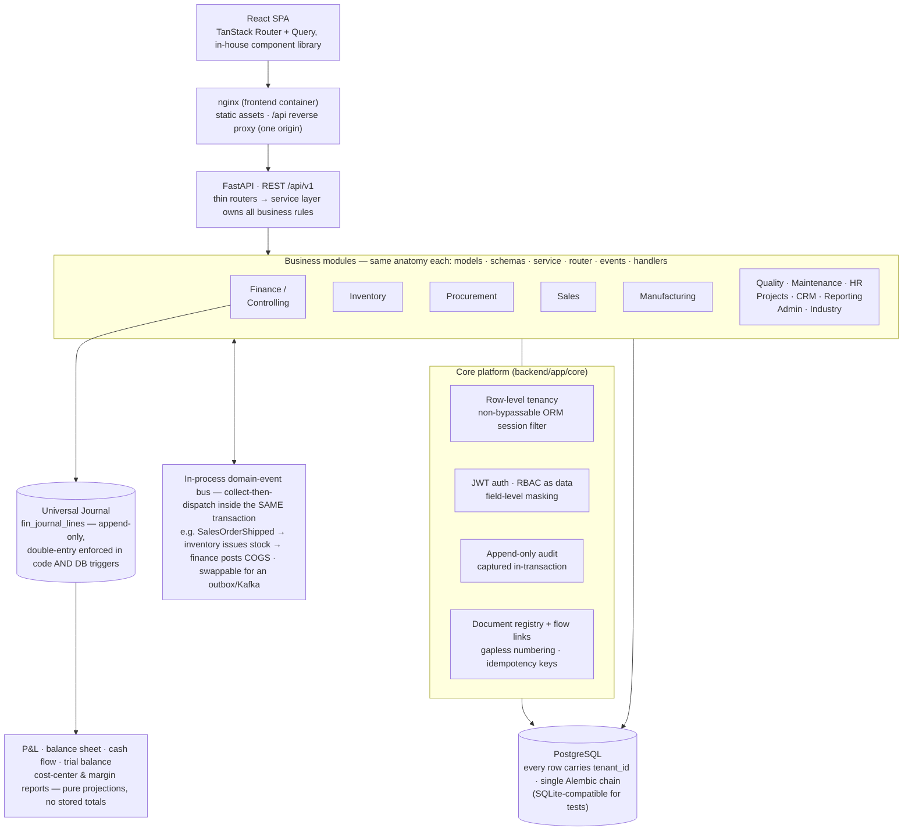

# Atlas ERP

**Atlas is an open-source, industry-agnostic ERP platform. Its functional benchmark is SAP S/4HANA.**

Rather than inventing an ERP feature set from scratch, Atlas derives its scope from a researched parity map of S/4HANA's line-of-business modules — Finance & Controlling, Inventory & Warehousing, Procurement, Sales & Distribution, Manufacturing, Quality & Maintenance, HR, Projects — and inherits two of S/4HANA's defining design principles outright:

1. **Universal Journal** — one append-only financial line-item table is the single source of truth; every financial and controlling view (P&L, balance sheet, cost-center reports, margin analysis) is a projection of it, never a separately stored total.
2. **Document flow** — every business document records its predecessor/successor links, so the full chain (requisition → PO → goods receipt → invoice → journal) is traceable and renderable for any document.

The parity map lives at [docs/research/s4hana-parity.md](docs/research/s4hana-parity.md) and is kept honest: every capability is marked full / partial / out-of-scope for v1, with reasons and an upgrade path. The build journal is public too: [PLAN.md](PLAN.md), [PROGRESS.md](PROGRESS.md), [DECISIONS.md](DECISIONS.md).

## Quickstart

Prerequisite: Docker with the Compose plugin. Everything else runs inside containers.

1. `git clone https://github.com/Taha-Mahmoodi/atlas-erp.git && cd atlas-erp`
2. `docker compose up --build` — builds and starts PostgreSQL, the API (migrations run on boot), the web app, and a one-shot seed job that populates **six demo tenants** (`acme` plus one per industry template) with ~3 months of interlinked transactions through the real API. First seed takes a few minutes; it's done when `seed-1` prints its per-tenant summaries and exits with code 0.
3. Open **http://localhost:5173** and log in: tenant `acme`, email `owner@acme.test`, password `correct-horse-battery`. The other tenants (`manufacturing`, `retail`, `professional-services`, `healthcare`, `construction`) use `owner@<tenant>.test` with the same password.
4. Explore the API directly if you like: OpenAPI UI at http://localhost:8000/api/v1/docs, health at http://localhost:8000/api/v1/health.
5. Tear down with `docker compose down -v` (drops the database volume; the next `up` reseeds).

Notes: seeding is opt-in via `ATLAS_SEED_DEMO` (default `1` in compose; set `0` to skip) and refuses to run against a production database. Set a real `ATLAS_JWT_SECRET` in the environment for anything reachable from outside your machine. For contributor (non-Docker) workflows see [CONTRIBUTING.md](CONTRIBUTING.md).

## Architecture

Every request runs inside one tenant context: a session-level ORM filter injects `tenant_id` into every query (lazy loads and bulk writes included) and fails closed when no tenant is set — query authors cannot bypass it. Cross-module effects go through the event bus only; synchronous cross-module reads go through the owning module's `queries.py`. The full specification of each mechanism is in [docs/architecture.md](docs/architecture.md), and every consequential choice is logged in [DECISIONS.md](DECISIONS.md).

## Data model (core entities)

The ~15 load-bearing tables out of ~120. Every table also carries `tenant_id` (omitted below); every business document row is registered in `core_documents`, whose `core_doc_links` edges form the document-flow graph. AP/AR journal lines reference vendors/customers by an opaque `partner_id`, so finance never imports another module's models.

```mermaid
erDiagram
    adm_tenants ||--o{ core_users : has
    adm_tenants {
        uuid id PK
        string slug
        string name
    }
    core_users {
        uuid id PK
        string email
        int token_version
    }

    core_documents ||--o{ core_doc_links : "predecessor of"
    core_documents ||--o{ core_doc_links : "successor of"
    core_documents {
        uuid id PK
        string doc_type
        string doc_no "gapless, claimed at posting"
    }
    core_doc_links {
        uuid predecessor_id FK
        uuid successor_id FK
    }

    fin_journal_entries ||--o{ fin_journal_lines : contains
    fin_accounts ||--o{ fin_journal_lines : posts_to
    fin_fiscal_periods ||--o{ fin_journal_entries : "open period only"
    core_documents ||--|| fin_journal_entries : registers
    fin_journal_entries {
        uuid id PK
        string entry_number
        date posting_date
        string status "DRAFT to POSTED, immutable after"
        uuid reverses_entry_id FK "corrections only via reversal"
    }
    fin_journal_lines {
        uuid journal_entry_id FK
        uuid account_id FK
        decimal debit_xor_credit "one side CHECK"
        uuid cost_center_id "CO dimensions on the line"
        uuid partner_id "opaque vendor or customer ref"
    }
    fin_accounts {
        uuid id PK
        string code
        string type "asset liability equity revenue expense"
    }
    fin_fiscal_periods {
        uuid id PK
        string status "OPEN or CLOSED, DB trigger enforced"
    }

    inv_items ||--o{ inv_stock_moves : moves
    inv_warehouses ||--o{ inv_stock_moves : "in or out"
    core_documents ||--|| inv_stock_moves : registers
    inv_items {
        uuid id PK
        string code
        string costing_method "moving average or FIFO"
    }
    inv_warehouses {
        uuid id PK
        string code
    }
    inv_stock_moves {
        uuid item_id FK
        uuid warehouse_id FK
        decimal quantity
        string move_type "receipt issue transfer count"
    }

    proc_vendors ||--o{ proc_purchase_orders : receives
    core_documents ||--|| proc_purchase_orders : registers
    proc_vendors {
        uuid id PK
        string name
        int payment_terms_days
    }
    proc_purchase_orders {
        uuid vendor_id FK
        string po_number
        string status
    }

    sales_customers ||--o{ sales_orders : places
    core_documents ||--|| sales_orders : registers
    sales_customers {
        uuid id PK
        string name
        decimal credit_limit
    }
    sales_orders {
        uuid customer_id FK
        string order_number
        string status
        decimal total_amount
    }
```

Around these sit the rest of each module: PO/order/delivery/billing **lines**, goods receipts and 3-way match, cost layers and quants, BOMs/routings/production orders, employees/leave/payroll, projects/WBS, leads/opportunities — all following the same pattern (module-prefixed tables, composite tenant FKs, document registration for anything postable).

## What's inside

- **Finance & Controlling** ([guide](docs/modules/finance.md)) — universal journal (double-entry enforced in code *and* DB triggers, immutable posted entries), fiscal periods with closed-period DB guards, multi-currency with realized + auto-reversing unrealized FX, line-level tax, AP/AR with background payment runs, aging and dunning, cost/profit centers and allocations, bank reconciliation, asset accounting with depreciation runs, and all financial statements as pure journal projections
- **Inventory & Warehouse** ([guide](docs/modules/inventory.md)) — items, categories, UoM conversions, lot/serial; warehouses, bins, and stock moves as the on-hand single source of truth; moving-average *and* FIFO costing with same-transaction COGS; physical and cycle counts with variance posting
- **Procurement** ([guide](docs/modules/procurement.md)) — vendor master, requisition → RFQ → PO with data-driven approval thresholds, goods receipt with GR/IR clearing, 3-way match → AP bill, reorder-point requisitions
- **Sales & Distribution** ([guide](docs/modules/sales.md)) — customer master with pricing, quote → order with ATP and credit-limit checks, delivery with partial shipments (stock issue + COGS), billing → revenue, and RMA returns with credit notes
- **Manufacturing** ([guide](docs/modules/manufacturing.md)) — BOMs, work centers, routings; production orders with WIP journals; MRP run with a rough capacity check
- **Quality & Maintenance** ([quality](docs/modules/quality.md) · [maintenance](docs/modules/maintenance.md)) — goods-receipt inspection lots with disposition; equipment register with corrective and preventive orders
- **HR & Payroll** ([guide](docs/modules/hr.md)) — employees with masked compensation and org chart, leave accruals with approval, time tracking allocated to projects/cost centers, and a gross→net payroll run posting a balanced journal
- **Projects** ([guide](docs/modules/projects.md)) — projects and WBS costing objects with a cost report
- **CRM** ([guide](docs/modules/crm.md)) — leads → opportunities kanban, activities, and conversion
- **Reporting** ([guide](docs/modules/reporting.md)) — role-based dashboard KPIs and a generic whitelist-driven, tenant-scoped report builder
- **Industry templates & onboarding** ([guide](docs/modules/industry.md)) — five industry templates (manufacturing, retail, professional-services, healthcare, construction) applied idempotently, and a one-call tenant onboarding wizard
- **Admin** ([guide](docs/modules/admin.md)) — user/role management, permission catalog, audit-log viewer, and per-tenant number-sequence viewer

All of it on the core platform ([guide](docs/modules/core.md)): non-bypassable row-level multi-tenancy, JWT auth (argon2id, rotating refresh sessions), RBAC as data with field masking, in-transaction append-only audit, the domain-event bus, document-flow chains, gapless numbering, idempotency keys, keyset pagination, an in-process background-job runner, and a wall-clock performance budget suite. The web frontend covers every module with role-based home pages and an in-house component library (data grid, form builder, kanban, dashboard cards, document-flow viewer).

## Stack

| Layer | Choice |
|---|---|
| Backend | Python 3.12 · FastAPI · SQLAlchemy 2.0 (async) · PostgreSQL (SQLite-compatible tests) · Alembic · Pydantic v2 |
| Frontend | React 18 · TypeScript · Vite · TanStack Query + Router · Tailwind · in-house component library |
| Platform | Multi-tenant (row-level isolation) · JWT + RBAC-as-data · append-only audit · in-process domain-event bus · REST `/api/v1` |

## What v1 deliberately excludes — and how to add it

Atlas v1 is scoped by the [parity map](docs/research/s4hana-parity.md): 45 capabilities at full parity, 48 partial, 46 deliberately out. Every cut is recorded there with its rationale and an intended later path — the table below condenses the load-bearing ones. The rule that shaped the cuts (from [PLAN.md](PLAN.md)): frontend polish is cut before backend correctness, and module breadth before financial-engine depth.

| Not in v1 | The boundary today | How to add it |
|---|---|---|
| **Parallel ledgers / multi-GAAP** | One universal-journal ledger, single-GAAP, entity-level statements | Add a ledger dimension on journal entries so postings fan out, then a document-splitting rule engine at posting time |
| **Plan/actual & budgeting** | Actuals only — no plan ledger for cost centers or projects, no budget checks | Add a plan-line ledger parallel to the journal; extend cost-center/margin/project reports with plan/actual/variance columns; budget objects with posting-time availability control |
| **Activity-based allocation & actual costing** | Direct journal postings and periodic allocations; no activity rates or material ledger | Activity types with planned rates generating secondary-cost lines from confirmations; a periodic actual-cost roll-up posting revaluations |
| **Credit & collections management** | AR stops at invoices, receipts, dunning levels, aging (credit *limits* exist on sales orders) | Collections worklists driven by the existing aging data; dispute cases linked to open items |
| **Purchasing & sales contracts** | Discrete requisition→PO and quote→order chains only; no outline agreements or drawdown | A contract document type with committed qty/value; POs/orders reference it as release orders consuming the commitment |
| **Warehouse execution depth** | Manual bin choice on stock moves; no putaway/picking strategies, waves, tasks, or handling units | A rule-based bin-determination service at move creation (fixed-bin, FIFO/FEFO first); a warehouse-task layer between documents and moves; an HU entity wrapping quants |
| **Output management** | No rendering/transmission of order confirmations, delivery notes, or invoices to business partners | A template-based PDF/email output service keyed by document type and partner, as a cross-module service |
| **Forecast-driven planning** | MRP consumes sales-order demand and reorder points only; discrete production only | A PIR table with planning strategies and forecast consumption feeding the existing MRP run; kanban/repetitive/process manufacturing as later layers |
| **Inspection plans & quality notifications** | Inspection lots are plan-less binary accept/reject; no defect/CAPA workflow | Inspection plan + characteristic masters, characteristic-level results recording, and a shared notification object (quality + maintenance) |
| **Maintenance depth** | Corrective/preventive orders directly on equipment; no notifications, counters, or task lists | A lightweight notification convertible to an order; measuring points feeding plan scheduling; reusable task lists |
| **Talent & benefits (HR)** | Core HR, leave, time, and payroll-lite (statutory compliance out) | Separate talent module or integrate an open-source ATS/LMS against the employee/org APIs; benefits once payroll gains real deduction handling |
| **Project execution depth** | WBS-only cost collection with a cost report | Activities/networks under WBS, then scheduling and milestones, then settlement rules reusing the finance allocation engine, then billing integration from posted time |
| **Horizontal scale-out** | In-process event bus and job runner; one API process per deployment (sized in [PERFORMANCE.md](PERFORMANCE.md) for 50 concurrent users on a 4-vCPU VPS) | Both sit behind Protocols ([DECISIONS.md](DECISIONS.md) D-011/D-032): swap the bus for a transactional-outbox + Kafka/Redis consumer and the job runner for a real queue — business logic untouched |
| **Extensibility beyond custom fields** | Metadata-validated custom fields on core entities; no webhooks or extension points | Webhook/event hooks per document type on the existing bus; side-by-side extensions against the REST API |

Known open issues from the v1 QA pass worth reading before you rely on the affected corners: [#163](https://github.com/Taha-Mahmoodi/atlas-erp/issues/163) (kanban aria-labels leak column totals), [#164](https://github.com/Taha-Mahmoodi/atlas-erp/issues/164) (FormBuilder required-fields are enforced server-side only), [#165](https://github.com/Taha-Mahmoodi/atlas-erp/issues/165) (fresh-tenant admin role has too few permissions to see its own template's masters), [#166](https://github.com/Taha-Mahmoodi/atlas-erp/issues/166) (report-builder headers show wire names, not labels).

## Contributing

See [CONTRIBUTING.md](CONTRIBUTING.md) for the branch model, commit conventions, and the issue-first protocol. Security reports: [SECURITY.md](SECURITY.md).

## License

[Apache-2.0](LICENSE)
