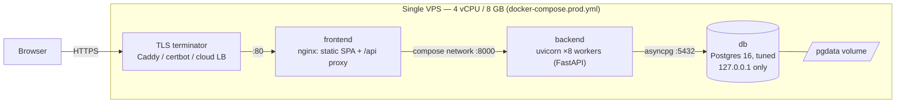

# Deployment — single-VPS reference topology (PERFORMANCE.md §7)

Atlas v1 is designed to run **well** for a 50-concurrent-user SME tenant on one
4 vCPU / 8 GB VPS. This document is the operator's guide to that box:
[`docker-compose.prod.yml`](../docker-compose.prod.yml), sizing, backup/restore,
and the measured proof that the PERFORMANCE.md §5 latency budgets hold on
Postgres. The dev/demo stack (with seeded demo tenants) is `docker-compose.yml`
— see the README quickstart.

## Topology

Everything on one box. nginx serves the built SPA and proxies `/api` to
FastAPI, so app and API share one origin (the auth refresh cookie is
same-origin); uvicorn runs 2× vCPU = 8 workers; Postgres listens on localhost
only.



```sh
# .env next to docker-compose.prod.yml — both are REQUIRED (compose refuses to start)
ATLAS_DB_PASSWORD=<url-safe password, no @ : / chars>
ATLAS_JWT_SECRET=<python -c "import secrets; print(secrets.token_urlsafe(64))">

docker compose -f docker-compose.prod.yml up -d --build
```

TLS is deliberately outside the compose file: put the VPS distro's Caddy
(`reverse_proxy localhost:80`) or certbot-managed nginx in front of port 80, or
a cloud load balancer. The backend sets audit IPs from `X-Forwarded-For`
(`ATLAS_TRUST_PROXY=1` in the compose file) because nginx is a trusted hop.

## Sizing

| Tier | Box | Postgres tuning | Notes |
|---|---|---|---|
| Demo / eval | 1 vCPU / 2 GB | `shared_buffers=512MB`, `effective_cache_size=1GB`, `--workers 2` | Fine for a handful of users |
| SME, ≤50 users | **4 vCPU / 8 GB** | as shipped: `shared_buffers=2GB`, `effective_cache_size=4GB`, `work_mem=16MB`, `--workers 8` | The reference config; §5 budgets validated below |
| ≤200 users | 8 vCPU / 16 GB | `shared_buffers=4GB`, `effective_cache_size=8GB`, `--workers 16`, raise `max_connections` to workers×15 + 30 | Or split the DB onto its own box (change `ATLAS_DATABASE_URL`, close port 80→5432 with a private network/VPN) |

The app tier is **stateless** (JWT auth, no server-side sessions, no local
files): horizontal scaling is "add another backend container behind the proxy."
Only Postgres holds state, so it is the one component you eventually move to
its own box or a managed service.

Sizing math baked into the compose file: `max_connections=150` covers 8 uvicorn
workers × SQLAlchemy's default pool (5 + 10 overflow) = 120 plus operator
sessions; memory limits (db 4G + backend 3G + frontend 256M) leave ~0.75 GB for
the OS on an 8 GB box; `shm_size: 1gb` keeps parallel report queries off the
64 MB container `/dev/shm` default.

## Backup & restore

Nightly logical backup — one line in cron, compressed custom format, safe to
run against a live database:

```sh
docker compose -f docker-compose.prod.yml exec -T db \
  pg_dump -U atlas -Fc atlas > /backups/atlas-$(date +%F).dump
```

Keep dumps **off the box** (object storage, `rclone`/`aws s3 cp` after the
dump). For point-in-time recovery between nightly dumps, additionally enable
WAL archiving (`archive_mode=on`, `archive_command` shipping to object storage,
e.g. via `wal-g`); a nightly dump alone bounds data loss at 24 h.

### Restore drill (exercised 2026-08-13)

Practiced against the prod-compose Postgres loaded with the full volume dataset
(120,800 journal lines, 50,000 stock moves, 10,000 sales orders — the §5 seed
plus the perf-suite tenant). Restore into a scratch database first; only repoint
the app after the counts check out:

```sh
# 1. dump (live)                                   → 18 MB, 1.1 s
docker compose -f docker-compose.prod.yml exec -T db pg_dump -U atlas -Fc atlas > atlas.dump

# 2. restore into a scratch DB on the same instance → 2.3 s
docker compose -f docker-compose.prod.yml exec -T db createdb -U atlas atlas_restore
docker compose -f docker-compose.prod.yml exec -T db pg_restore -U atlas -d atlas_restore --no-owner < atlas.dump

# 3. verify before switching anything over
docker compose -f docker-compose.prod.yml exec -T db psql -U atlas -Atc \
  "select (select count(*) from fin_journal_lines), (select count(*) from inv_stock_moves), (select count(*) from sales_orders)" atlas_restore
# drill result: 120800|50000|10000 — identical to the source database

# 4. real recovery only: stop the backend, swap databases, restart
#    (scratch drill: dropdb -U atlas atlas_restore)
```

Run the drill after any Postgres major-version upgrade and at least quarterly —
a backup that has never been restored is a hope, not a backup.

## Perf validation on Postgres (PERFORMANCE §5, run 2026-08-13)

Full pre-promotion run against the prod-compose Postgres (`postgres:16-alpine`
with the tuning above, verified via `SHOW`; Docker VM: 4 CPU). Procedure, from
`backend/`:

```sh
docker compose -f docker-compose.prod.yml up -d db
export ATLAS_DATABASE_URL="postgresql+asyncpg://atlas:<pw>@localhost:5432/atlas"
uv run alembic upgrade head                    # 45 migrations, clean
ATLAS_SEED_DEMO=1 ATLAS_ENV=dev ATLAS_JWT_SECRET=local-dev-secret \
  uv run python seed.py --volume               # 12.7 s: 5,000 items / 50,000 stock moves /
                                               # 10,000 orders / 25,200 entries / 100,800 lines / 3 fiscal years
ATLAS_PERF_DATABASE_URL="$ATLAS_DATABASE_URL" uv run pytest -q -m perf -s   # = make perf
```

The suite times its own bulk-seeded tenant (2,500 entries / 20,000 lines /
1,500 invoices, seeded in 5.0 s) inside tables already carrying the 100k-line
volume tenant, and asserts the **1×** Postgres budgets (median of 5 runs after
warm-up). Result: **6 passed, 0 failed** (`1 skipped` is the `pg`-marked
migration test outside the perf suite; 1,795 non-perf tests deselected).

| Measurement | §5 budget | Measured median | Headroom |
|---|---:|---:|---:|
| Journal-entries list API (status filter, page of 50, full auth path) | < 300 ms | 4.3 ms | ~70× |
| Trial balance (full year) | < 1.5 s | 5.2 ms | ~288× |
| Profit & loss (full year) | < 1.5 s | 5.3 ms | ~283× |
| Balance sheet (as of year-end) | < 1.5 s | 5.2 ms | ~288× |
| AR aging (as of year-end) | < 1.5 s | 6.9 ms | ~217× |
| Dataset sanity (volume + debits==credits pin) | — | passed | — |

Every budget passes with two orders of magnitude to spare; the volume-seed
throughput (100k+ lines in under 13 s) also proves the §2 bulk-insert patterns.
A future failing budget before a promotion is `severity:major` (§5): file the
issue, fix or consciously re-budget in DECISIONS.md — never delete the test.

## Why it stays fast

The budgets above are not luck; they are enforced invariants (PERFORMANCE.md
§1–§3):

- **Indexes are law (§1):** every FK column and every filtered/sorted column is
  indexed; composite indexes lead with `tenant_id` because every query filters
  on it. Report queries are date-bounded — nothing scans unbounded history at
  request time.
- **The N+1 ban is mechanical (§2):** list endpoints are asserted at ≤ 3 SQL
  statements per request by a query-counting test fixture, so a lazy-load
  regression fails CI instead of reaching a customer. Bulk jobs (MRP, payment
  runs, seeding) use set-based SQL, never per-row ORM loops.
- **The API can't be asked a slow question (§3):** every collection endpoint is
  cursor-paginated (max 200 rows), reports require date bounds and cap rows,
  responses are gzipped, and long-running work (MRP, payment runs) goes to
  background jobs instead of holding a request open.
- **This suite guards it all (§5):** the perf budgets rerun on every CI build
  (SQLite smoke at 2× budgets) and against Postgres — the run recorded above —
  before every promotion.
